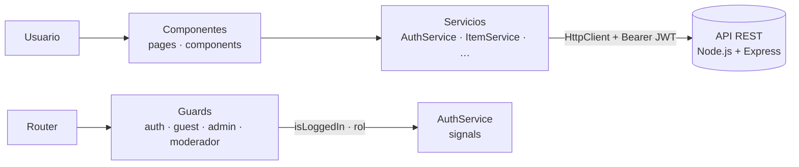

# 🛍️ ReMarket — Frontend de la Plataforma de Compraventa de Segunda Mano


SPA de Angular para una plataforma de compraventa de artículos tecnológicos de segunda mano, al estilo de Wallapop o PCComponentes: publicación de anuncios con fotos, búsqueda con filtros, paneles diferenciados por rol (usuario, moderador y administrador) y autenticación con JWT.

Desarrollada como **Proyecto Final del Máster Full Stack Developer (UNIR)**. Consume la API REST de Node.js + Express que vive en su propio repositorio: [UNIR-Proyecto-Final-Backend](https://github.com/javimateo/UNIR-Proyecto-Final).

---

## Índice

- [Características](#características)
- [Stack tecnológico](#stack-tecnológico)
- [Arquitectura](#arquitectura)
- [Estructura del proyecto](#estructura-del-proyecto)
- [Puesta en marcha](#puesta-en-marcha)
- [Rutas de la aplicación](#rutas-de-la-aplicación)
- [Autenticación y roles](#autenticación-y-roles)
- [Comunicación con la API](#comunicación-con-la-api)
- [Flujo de trabajo con Git](#flujo-de-trabajo-con-git)

---

## Características

- 🔐 **Login y registro** con validación reactiva y sesión persistente mediante JWT.
- 🏠 **Home con listado de anuncios** conectado a la API real: filtros combinables (búsqueda, categoría, condición, precio) y paginación.
- 📦 **CRUD de anuncios** — publicación, edición y detalle de artículos con fotos, categoría, estado de conservación y precio.
- 👥 **Vistas diferenciadas por rol** — el rol del usuario (`user`, `moderator`, `admin`) determina qué rutas y paneles son accesibles.
- 🛡️ **Guards de ruta** — `authGuard`, `guestGuard`, `adminGuard` y `moderadorGuard` protegen la navegación según el estado de sesión y el rol.
- ⚙️ **Panel de administración** — gestión de usuarios, roles, categorías y estadísticas globales de la plataforma.
- 🚩 **Panel de moderación** — reportes, incidencias, historial y notificaciones.
- 🎨 **UI con Bootstrap 5** — diseño responsive, iconografía con Bootstrap Icons y diálogos con SweetAlert2.

## Stack tecnológico

| Tecnología | Versión | Uso |
| --- | --- | --- |
| [Angular](https://angular.dev/) | 21 | Framework SPA (componentes standalone + signals) |
| [TypeScript](https://www.typescriptlang.org/) | 5.9 | Lenguaje con tipado estático |
| [RxJS](https://rxjs.dev/) | 7.8 | Programación reactiva sobre `HttpClient` |
| [Bootstrap](https://getbootstrap.com/) | 5.3 | Sistema de diseño y componentes CSS |
| [Bootstrap Icons](https://icons.getbootstrap.com/) | 1.11 | Iconografía (vía CDN) |
| [SweetAlert2](https://sweetalert2.github.io/) | 11.x | Diálogos y alertas |
| [Vitest](https://vitest.dev/) | 4.x (dev) | Test runner |
| [Prettier](https://prettier.io/) | 3.x (dev) | Formateo de código |

## Arquitectura

Aplicación construida con **componentes standalone** de Angular (sin NgModules) y estado de sesión gestionado con **signals**. La lógica de negocio vive en servicios inyectables; los componentes solo gestionan la vista.



- **Componentes** (`pages/`, `components/`) — un componente por vista; los reutilizables (como `item-card`) viven en `components/`.
- **Servicios** (`service/`) — encapsulan las llamadas HTTP a la API y el estado compartido. `AuthService` es el singleton que centraliza la sesión: guarda el JWT, recupera el perfil (`/auth/me`) y expone `currentUser` e `isLoggedIn` como signals.
- **Guards** (`guards/`) — funciones `canActivate` que consultan `AuthService` para permitir o redirigir la navegación según sesión y rol.
- **Interfaces** (`interface/`) — modelos de datos tipados (`IItem`, `IUser`, filtros, respuestas de la API). Sin `any`.

## Estructura del proyecto

```text
├── angular.json              # Configuración del workspace (estilos de Bootstrap incluidos)
├── src/
│   ├── index.html            # Documento base (carga Bootstrap Icons por CDN)
│   ├── main.ts               # Bootstrap de la aplicación
│   ├── styles.css            # Estilos globales
│   └── app/
│       ├── app.ts            # Componente raíz (navbar + footer condicionales por sesión)
│       ├── app.routes.ts     # Definición de rutas y guards
│       ├── app.config.ts     # Providers: router + HttpClient
│       ├── components/
│       │   └── item-card/    # Tarjeta de anuncio reutilizable
│       ├── guards/
│       │   ├── auth.guard.ts       # Requiere sesión iniciada
│       │   ├── guest.guard.ts      # Solo sin sesión (login)
│       │   ├── admin-guard.ts      # Requiere rol admin
│       │   └── moderador-guard.ts  # Requiere rol moderator
│       ├── interface/        # IItem, IUser, IItemFilters, AuthResponse…
│       ├── service/
│       │   ├── auth.service.ts     # Sesión JWT con signals
│       │   ├── item.service.ts     # CRUD de anuncios + filtros + categorías
│       │   ├── iuser.services.ts   # Gestión de usuarios (admin)
│       │   └── icategoria-form.services.ts  # CRUD de categorías (admin)
│       └── pages/
│           ├── login/        # Login + registro (pestañas)
│           ├── home/         # Listado con filtros y paginación
│           ├── item-detail/  # Detalle de un anuncio
│           ├── item-form/    # Crear / editar anuncio
│           ├── user-dashboard/    # Panel del usuario
│           ├── admin-dashboard/   # Usuarios · categorías · estadísticas
│           └── moderator/    # Reportes · incidencias · historial · notificaciones
└── package.json
```

## Puesta en marcha

### Requisitos

- Node.js **18 o superior**
- El [backend](https://github.com/javimateo/UNIR-Proyecto-Final) corriendo en `http://localhost:3000` (con la base de datos y el *seed* cargados)

### 1. Instalar dependencias

```bash
npm install
```

### 2. Arrancar en desarrollo

```bash
npm start
```

La aplicación queda disponible en **`http://localhost:4200`** con recarga automática.

### 3. Build de producción

```bash
npm run build
```

> El *seed* del backend incluye usuarios de los tres roles, útiles para probar cada panel desde el login.

## Rutas de la aplicación

| Ruta | Vista | Acceso |
| --- | --- | --- |
| `/login` | Login y registro (pestañas) | Solo invitados (`guestGuard`) |
| `/home` | Listado de anuncios con filtros y paginación | 🔒 sesión (`authGuard`) |
| `/anuncio/nuevo` | Publicar un anuncio | 🔒 sesión |
| `/anuncio/editar/:id` | Editar un anuncio propio | 🔒 sesión + propietario |
| `/anuncio/:id` | Detalle de un anuncio | 🔒 sesión |
| `/dashboard` | Panel del usuario | 🔒 sesión |
| `/admin-dashboard` | Panel de administración | 🔒 rol `admin` (`adminGuard`) |
| `/mod-dashboard` | Panel de moderación | 🔒 rol `moderator` (`moderadorGuard`) |
| `/reported-products` · `/report-detail` · `/incidents` · `/history` · `/notification` | Vistas del módulo de moderación | Moderación |

Tras el login, la aplicación redirige automáticamente al panel correspondiente según el rol del usuario.

## Autenticación y roles

El flujo de sesión está centralizado en `AuthService`:

1. `POST /api/auth/login` devuelve un **JWT**, que se guarda en `localStorage`.
2. Con el token se recupera el perfil en `GET /api/auth/me` y se almacena el usuario en un **signal** (`currentUser`), persistido también en `localStorage` para sobrevivir recargas.
3. `isLoggedIn` es un `computed` derivado del signal — navbar, footer y guards reaccionan automáticamente al iniciar o cerrar sesión.
4. Las llamadas protegidas adjuntan el header `Authorization: Bearer <token>`.

| Rol | Vistas accesibles |
| --- | --- |
| `user` | Home, anuncios (publicar/editar los suyos), detalle, panel de usuario |
| `moderator` | Todo lo anterior + panel de moderación (reportes e incidencias) |
| `admin` | Todo lo anterior + panel de administración (usuarios, roles, categorías, estadísticas) |

## Comunicación con la API

Los servicios consumen la API REST del backend (`http://localhost:3000/api`) mediante `HttpClient`:

| Servicio | Endpoints que consume | Uso |
| --- | --- | --- |
| `AuthService` | `POST /auth/login` · `POST /auth/register` · `GET /auth/me` | Sesión y perfil |
| `ItemService` | `GET /items` (filtros + paginación) · `GET /items/:id` · `POST /items` · `PUT /items/:id` · `GET /categories` | Anuncios y categorías |
| `IUserServices` | `GET /users` · `PUT /users/:id` · `PATCH /users/:id/role` · `PATCH /users/:id/status` · `GET /admin/stats` | Panel de administración |
| `IcategoriaFormServices` | `GET /categories` · `POST /categories` · `PUT /categories/:id` · `DELETE /categories/:id` | Gestión de categorías |

El listado de anuncios envía los filtros `search`, `category_id`, `item_condition`, `min_price`, `max_price`, `page` y `per_page` como query params y consume la respuesta paginada `{ results, total, page, total_pages }`.

## Flujo de trabajo con Git

| Rama | Uso |
| --- | --- |
| `main` | Código estable del frontend. |
| `feature/<nombre>` | Nueva funcionalidad. Sale de `main`, vuelve a `main` vía PR. |
| `fix/<nombre>` | Corrección de bug. Sale de `main`, vuelve a `main` vía PR. |

```bash
# 1. Sincronizar main
git checkout main && git pull origin main

# 2. Crear la rama de trabajo
git checkout -b feature/mi-funcionalidad

# 3. Commitear siguiendo la convención
git commit -m "feat: descripción del cambio"

# 4. Publicar y abrir PR hacia main
git push origin feature/mi-funcionalidad
```

**Convención de commits:** `feat:` nueva funcionalidad · `fix:` corrección · `docs:` documentación · `refactor:` cambio sin funcionalidad nueva · `chore:` mantenimiento.

**Pull Requests:** toda rama se integra en `main` exclusivamente mediante PR, revisado por otro miembro del equipo. Borrar la rama tras el merge.

---

## Documentación relacionada

- [`API.md`](API.md) — referencia de los endpoints del backend que consume este frontend
- Repositorio del backend — [UNIR-Proyecto-Final](https://github.com/javimateo/UNIR-Proyecto-Final)
- Enunciado del proyecto — `enunciado.md`
